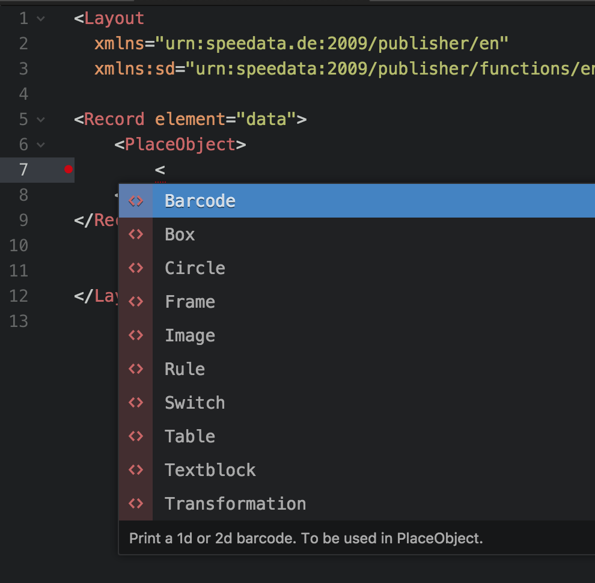

# language package for the speedata Publisher

This package allows you to use the atom editor with the speedata Publisher.

## Installation

You can install this package from the [Atom](https://atom.io/) editor by going into the Preferences, select “Install” and type `speedata`, click on “Package”. You should see the “Install” button now. You could alternatively choose to install the package from the command line with `apm install language-speedata-publisher`.

After restarting the editor you can create a (stub) Layout file with the correct name space:

    <Layout
      xmlns="urn:speedata.de:2009/publisher/en"
      xmlns:sd="urn:speedata:2009/publisher/functions/en">

    </Layout>

Now you should have auto completion for all the commands (elements), parameters (attributes) and documentation on both.

